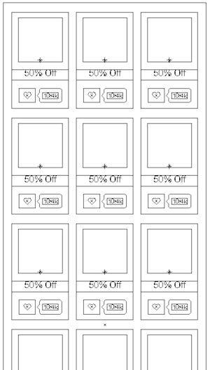
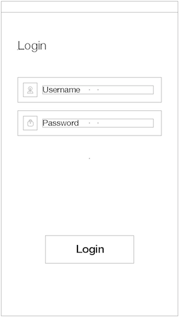

## Messing Around With AFNetworking ##

### Introduction ###

### Requirements ###

The Layout I want to build is:

 

Use the [design](design) folder for guidance, we would like you to focus on how the app works

1. Coupons
  - Show coupons from our REST API
  - Resource: `http://api.bluepromocode.com/v2/promotions`
  - Method: `GET` 

2. Login
  - Login using our REST API
  - Resource: `http://api.bluepromocode.com/v2/users/login`
  - Method: `POST` 
  - JSON Encoded Parameters: `email`, `password`
  - We have a test account you can use: email: `a@a.com`, password: `12345678`

3. Bonus: Signup
  - Signup using our REST API
  - Resource: `http://api.bluepromocode.com/v2/users/register`
  - Method: `POST` 
  - JSON Encoded Parameters: `fullName`, `email`, `password` 
	 
4. Bonus: Personalized Coupons 
  - Show personalized coupons from our REST API (requires authentication)
  - Resource: `http://api.bluepromocode.com/v2/users/self/promotions/suggestions`
  - Method: `GET` 

### Notes ###

Uses AFNetworking.. as a heads up this project is not MVC
